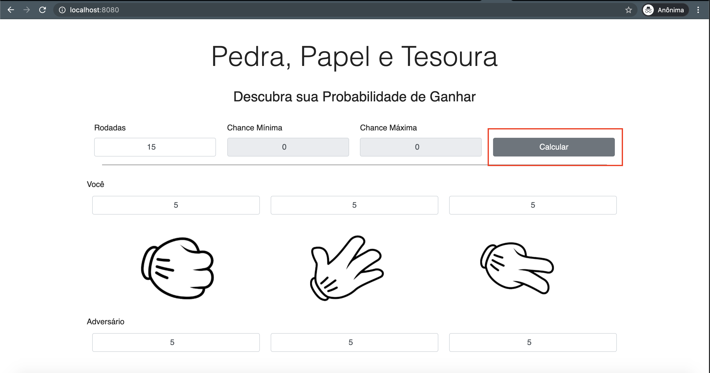
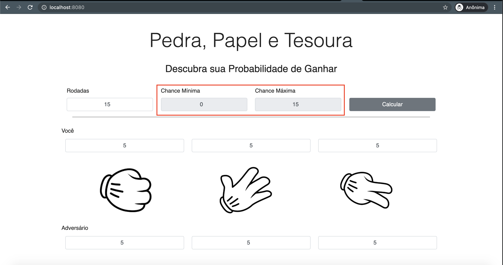

# Pedra, papel e tesoura

**Número da Lista**:  11<br>
**Conteúdo da Disciplina**: Greed<br>

## Alunos
|Matrícula | Aluno |
| -- | -- |
| 18/0103580 |  Jonathan Jorge Barbosa Oliveira |
| 19/0063441  |  Ana Carolina Carvalho |

## Sobre 
Pedra, papel e tesoura, também chamado em algumas regiões do Brasil de jokempô. 
No jogo de Pedra, Papel, Tesoura, os jogadores devem esticar a mão, com a sua escolha. Podendo ser representado da seguinte forma:

- A mão fechada significa Pedra;

- A mão aberta significa Papel;

- A mão com os dedos indicador e médio estendidos significa Tesoura.

O jogo consiste em várias rodadas, cada rodada é independente uma da outra. Em cada rodada, os dois jogadores mostram uma das seguintes coisas ao mesmo tempo: pedra, papel ou tesoura. Se ambos os jogadores mostraram as mesmas coisas, o resultado da rodada é um empate. Caso contrário, as seguintes regras se aplicam:

* se um jogador mostrou pedra e o outro mostrou tesoura, então o jogador que mostrou pedra é considerado o vencedor e o outro é considerado perdedor;
* se um jogador mostrou uma tesoura e o outro papel, então o jogador que mostrou uma tesoura é considerado o vencedor e o outro é considerado o perdedor;
* se um jogador mostrou papel e o outro pedra, então o jogador que mostrou papel é considerado o vencedor e o outro é considerado perdedor.

Considerando que você e mais um amigo decidiram jogar exatamente 𝑛 rodadas do jogo descrito acima. Você decidiu mostrar pedra 𝑎1 vezes, mostrar a tesoura 𝑎2 vezes e mostrar papel 𝑎3 vezes. Seu amigo decidiu mostrar pedra 𝑏1 vezes, mostrar a tesoura 𝑏2 vezes e mostrar papel 𝑏3 vezes. Porém, você e seu amigo não escolheram a sequência em que mostram as coisas. É garantido que 𝑎1+𝑎2+𝑎3= 𝑛 e 𝑏1+𝑏2+𝑏3= 𝑛. Ou seja, que jogaram a mesma quantidade de rodadas.

Nossa tarefa é estimar a quantidade máxima e mínima de vezes que você pode ganhar jogando contra seu amigo! 

## Screenshots
Adicione 3 ou mais screenshots do projeto em funcionamento.

## Instalação 

**Linguagem**: Javascript
**Framework**: Node

É necessário a instalação do Node.

Para clonar e rodar a aplicação, são necessários: [Git](https://git-scm.com), [Node](https://nodejs.org/pt-br/) instalados.

Para rodar o projeto você precisará rodar os seguintes comandos no terminal do seu computador:

#### Clone este repositório
```bash
cd ~/your/directory/
git clone https://github.com/projeto-de-algoritmos/Greed_Pedra_Papel_Tesoura.git
````

#### Vá para o diretório da aplicação
```bash
cd ./Greed_Pedra_Papel_Tesoura/
````

#### Construa a aplicação

Em abas separadas do terminal você deverá rodar:

``` bash
    cd Greed_Pedra_Papel_Tesoura/backend 
    npm install
    npm start
```
``` bash
    cd Greed_Pedra_Papel_Tesoura/frontend
    npm install
    npm start
```

#### Acesse o seguinte link em seu navegador

O servidor poderá ser acessado em http://localhost:3000 enquanto o frontend será acessado em http://localhost:8080

## Uso 

Ao acessar a página inicial, informe a quantidade de rodadas que serão jogadas. 


Após isso, adicione a quantidade de vezes que você pretendo usar a Pedra, Tesoura e Papel. Logo abaixo, insira os valores do seu amigo. 



Para ter o resultado de chances máximas e mínimas de ganhar, selecione a opção de "Calcular"




## Contribuintes 

[ <br> <sub> Ana Carvalho </sub>](https://github.com/anacarolcs)|[ <br> <sub> Jonathan Oliveira </sub>](https://github.com/Jonathan-Oliveira) |
| :---: | :---: |
